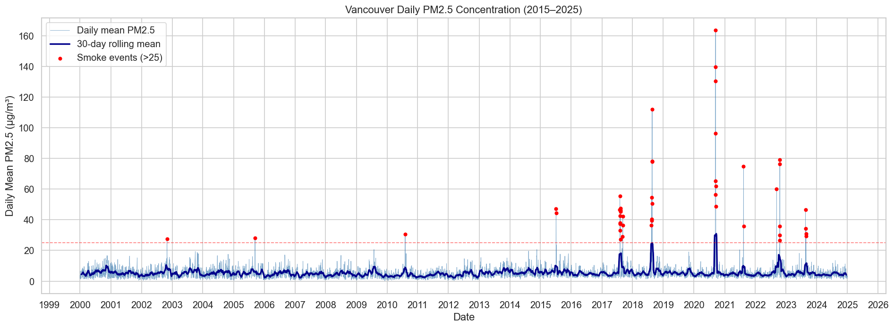
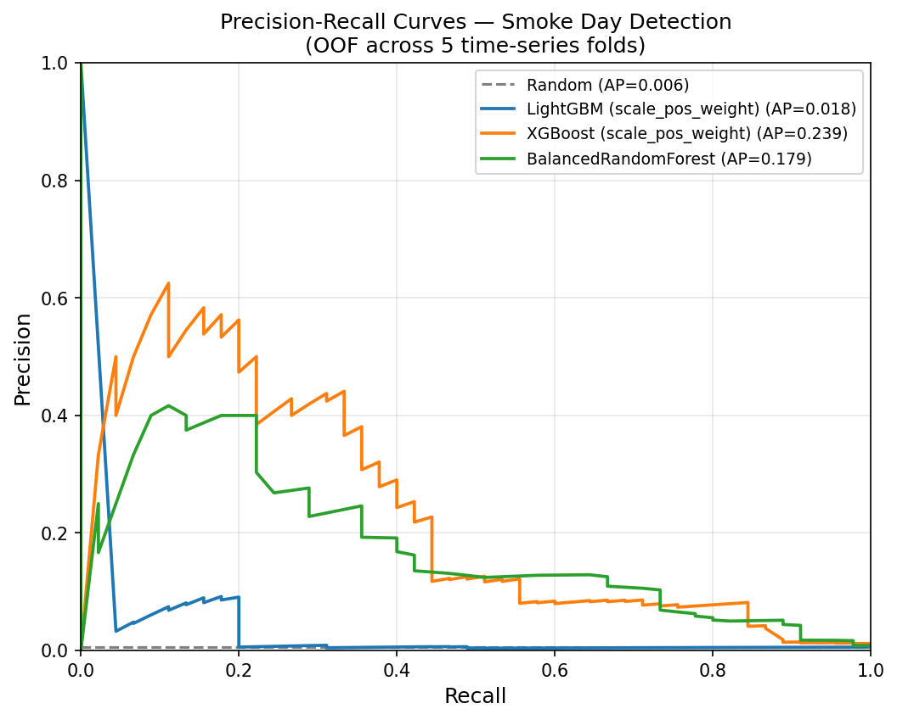
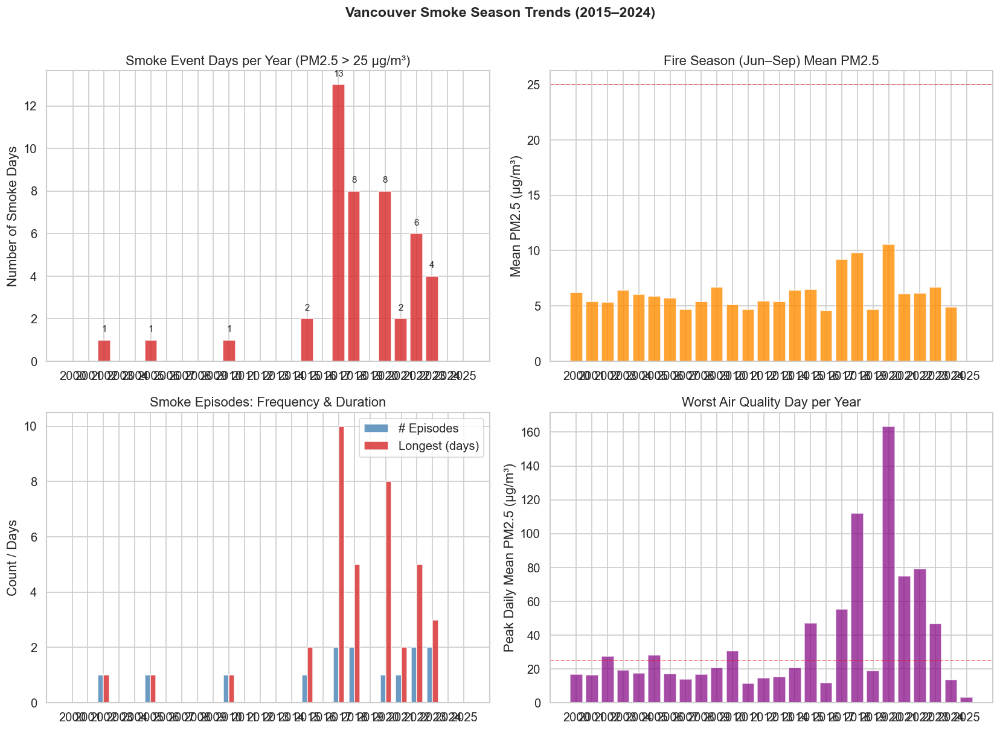

# Vancouver Wildfire Smoke Predictor

**Predicting and Profiling Wildfire Smoke Impacts on Vancouver's Air Quality (2000–2025)**

CMPT 733: Big Data Lab II | Simon Fraser University

---

## Overview

This project integrates daily PM2.5 air quality measurements, NASA MODIS/VIIRS satellite fire detections, and meteorological data to investigate wildfire smoke impacts on Vancouver, BC. It addresses three research questions:

1. **RQ1 — Forecasting:** Can ML models predict next-day PM2.5 more accurately than naive baselines?
2. **RQ2 — Lag Analysis:** What is the delay between BC wildfire activity and elevated PM2.5 in Vancouver?
3. **RQ3 — Trend Profiling:** How has Vancouver's wildfire smoke season changed from 2000 to 2025?


*Daily PM2.5 for Metro Vancouver (2000–2025). Smoke episodes (PM2.5 > 25 µg/m³) are highlighted; the September 2020 Oregon/Washington fire event peaked at 163.5 µg/m³.*

---

## Repository Structure

```
├── app/
│   └── streamlit_app.py              # Interactive dashboard (7 tabs)
├── data/
│   ├── raw/                          # Raw downloaded data (gitignored)
│   └── processed/
│       └── merged/dataset.csv        # Final merged dataset (9,133 x 90)
├── docs/
│   ├── report_final.md               # Full academic report (Phase 1 + Phase 2)
│   ├── experiment_results.md         # Detailed Phase 2 experiment results (9 experiments)
│   └── modeling_summary.md           # Concise Phase 2 modeling summary
├── figures/                          # Generated visualizations (22 PNGs)
├── notebooks/
│   ├── 01_eda.ipynb                  # EDA & seasonal risk profiling (RQ3)
│   ├── 02_lag_analysis.ipynb         # Smoke arrival lag analysis (RQ2)
│   ├── 03_modeling.ipynb             # Predictive modeling Phase 1 (RQ1)
│   └── 04_smoke_day_modeling.ipynb   # Phase 2 smoke-day specialisation summary
├── scripts/
│   ├── build_dataset.py              # Dataset construction pipeline
│   ├── download_bc_air_quality.py    # BC Ministry of Environment FTP downloader
│   ├── download_historical_fires.py  # NASA FIRMS MODIS/VIIRS downloader
│   ├── download_weather.py           # Open-Meteo Historical API downloader
│   ├── download_all_25years.py       # Bulk 25-year download helper
│   │
│   ├── # Phase 2 — Exploratory / Diagnostic
│   ├── analyze_smoke.py              # EDA: correlations, episode stats, wind analysis
│   ├── analyze_missed_episodes.py    # Gate recall analysis per smoke episode
│   │
│   ├── # Phase 2 — Residual Framing
│   ├── test_residual_model.py        # LightGBM MAE on pm25_diff (beats persistence)
│   ├── test_refined_residual.py      # Residual model + wind-fire interaction features
│   │
│   ├── # Phase 2 — Loss Function Experiments
│   ├── train_asymmetric_loss.py      # Quantile sweep (Q=0.75/0.80/0.90/0.95) + alt losses
│   │
│   ├── # Phase 2 — Architecture Experiments
│   ├── train_residual_correction.py  # Two-layer stacking: base + fire-day correction
│   ├── train_soft_blend.py           # Soft gate blending (MAE + Q=0.80)
│   ├── train_fire_subset.py          # Feature subset ablation for smoke-day focus
│   ├── train_hurdle_model.py         # Hurdle model: gate + quantile smoke-day regressor
│   │
│   ├── # Phase 2 — Classification
│   ├── train_smoke_detector.py       # XGBoost/LightGBM/BRF binary smoke-day classifier
│   ├── train_anomaly_gate.py         # RF-based anomaly gate (predecessor)
│   │
│   ├── # Phase 2 — Optimisation & Deep Learning
│   ├── tune_residual_model.py        # Optuna HPO (30 trials) on Q=0.75 model
│   └── train_lstm.py                 # 2-layer PyTorch LSTM (negative result: −27% vs persistence)
└── requirements.txt
```

---

## Data Sources

| Source | Coverage | Description |
|---|---|---|
| BC Ministry of Environment FTP | 2000–2024 | Hourly PM2.5 from Metro Vancouver stations |
| NASA FIRMS MODIS | 2000–2011 | Active fire detections (Canada) |
| NASA FIRMS VIIRS | 2012–2024 | Active fire detections (Canada) |
| Open-Meteo Historical API | 2000–2025 | Daily weather for Vancouver (49.25°N, 123.12°W) |

The final merged dataset is **9,133 rows × 90 columns**, covering 2000-01-01 to 2025-01-01 with zero missing days.

---

## Setup

```bash
python -m venv venv
source venv/bin/activate          # Windows: venv\Scripts\activate
pip install -r requirements.txt
```

### Rebuild the Dataset (optional — `dataset.csv` is included)

```bash
python scripts/download_bc_air_quality.py
python scripts/download_historical_fires.py
python scripts/download_weather.py
python scripts/build_dataset.py
```

### Run the Streamlit Dashboard

```bash
streamlit run app/streamlit_app.py
```

### Execute Notebooks

```bash
jupyter notebook
```

Open and run `notebooks/01_eda.ipynb`, `02_lag_analysis.ipynb`, `03_modeling.ipynb` in order.

### Run Phase 2 Modeling Scripts

All scripts run from the project root against the existing `data/processed/merged/dataset.csv`:

```bash
# Core result (beats persistence on smoke days)
python scripts/test_residual_model.py
python scripts/train_asymmetric_loss.py      # Q=0.80 key result
python scripts/train_fire_subset.py          # Best smoke-day model

# Smoke classifier
python scripts/train_smoke_detector.py       # XGBoost gate, AUPRC=0.331

# Architecture experiments
python scripts/train_residual_correction.py
python scripts/train_soft_blend.py

# Negative results (documented)
python scripts/train_lstm.py                 # requires torch
python scripts/tune_residual_model.py        # requires optuna
```

---

## Key Results

### RQ1 — PM2.5 Forecasting

**Phase 1 — Standard models (all vs persistence):**

| Model | MAE | R² |
|---|---|---|
| **Persistence baseline** | **1.694** | **0.600** |
| Random Forest (best ML) | 1.783 | 0.165 |
| LightGBM (Tuned) | 1.845 | 0.146 |

Persistence beats every ML model overall. The dominant signal is PM2.5 lag-1 (~40% feature importance, r = 0.82). Removing fire features *improves* the standard model (MAE 1.793 → 1.750).

**Phase 2 — Smoke-day specialisation (vs persistence smoke-day MAE = 22.353):**

| Model | Overall MAE | Smoke-day MAE | Smoke Δ |
|---|---|---|---|
| Persistence | 1.668 | 22.353 | — |
| LightGBM MAE (residual framing) | 1.504 | 22.181 | +0.172 |
| **Q=0.80 fire-only (best smoke-day)** | **2.075** | **21.729** | **+0.624** |
| XGBoost smoke classifier | AUPRC=0.331 | 8/13 episodes | — |

Residual framing (predicting the change, not raw PM2.5) is the single most important architectural choice. Quantile regression at Q=0.80 with fire-only features beats persistence on the 46 smoke days while remaining interpretable and deployable.


*Precision-recall curves for Phase 2 binary smoke-day classifiers. AUPRC = 0.331 vs. a random baseline of ~0.005 — a 66x improvement despite only 0.5% positive class rate.*

### RQ2 — Smoke Arrival Lag

Cross-correlation peaks at **lag 0** across all distance bands, indicating smoke transport from fire to city occurs within the same calendar day at daily resolution. Adding fire lag features to PM2.5 autoregression improves R² by only 0.012.

### RQ3 — Seasonal Risk Profiling

Over 2000–2024: **46 smoke days** across **14 episodes**. Spearman trend tests show statistically significant upward trends in:
- Smoke day frequency (ρ = 0.480, p = 0.015)
- Peak episode severity (ρ = 0.648, p = 0.043)
- Episode duration (ρ = 0.483, p = 0.015)

The worst event (September 2020, peak PM2.5 = 163.5 µg/m³) originated from Oregon/Washington fires — the XGBoost gate assigns zero fire activity on this day (`fire_count_total = 0`), confirming this is a data ceiling, not a model ceiling.


*Annual smoke day counts (2000–2024). Frequency, peak severity, and episode duration all show statistically significant upward trends (Spearman ρ = 0.48–0.65, p < 0.05).*

---

## Streamlit Dashboard

> **Note:** The dashboard runs locally. No public deployment is provided. To launch it, follow the setup steps above and run `streamlit run app/streamlit_app.py` from the project root.

The interactive dashboard (`app/streamlit_app.py`) provides 7 tabs:

- **Overview** — Dataset summary and PM2.5 time series
- **Smoke Season Trends** — Annual smoke day counts and trend analysis
- **Smoke Arrival Lag** — Cross-correlation and lag visualizations
- **PM2.5 Forecasting** — Model comparison with time-series CV
- **Model Validation** — Holdout test on 2021–2024
- **Health & Planning** — Smoke event calendar and weather context
- **Data Explorer** — Interactive data table with CSV export

---

## Documentation

| Document | Description |
|---|---|
| [`docs/report_final.md`](docs/report_final.md) | Full academic report covering Phase 1 and Phase 2 |
| [`docs/experiment_results.md`](docs/experiment_results.md) | Detailed results for all 9 Phase 2 experiments |
| [`docs/modeling_summary.md`](docs/modeling_summary.md) | Concise Phase 2 modeling summary |

---

## Requirements

- Python 3.9+
- Core: `pandas`, `numpy`, `scikit-learn`, `xgboost`, `lightgbm`, `streamlit`, `plotly`, `matplotlib`, `seaborn`
- Phase 2 extras: `imbalanced-learn` (smoke detector), `optuna` (HPO), `torch` (LSTM)
- See `requirements.txt` for full dependency list
