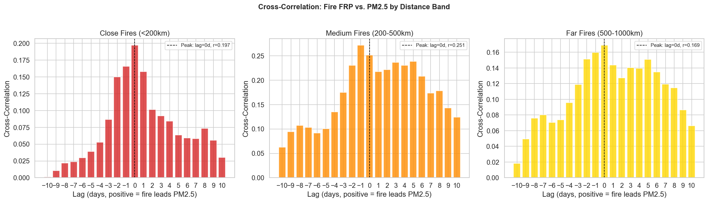
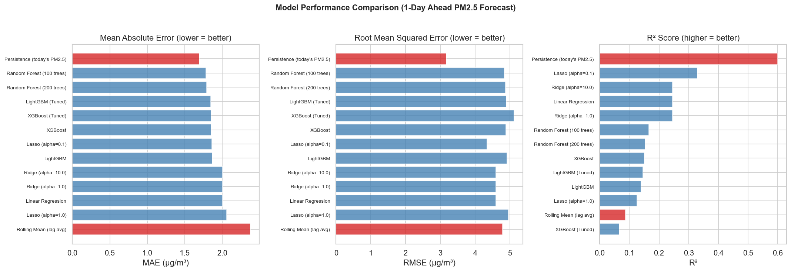
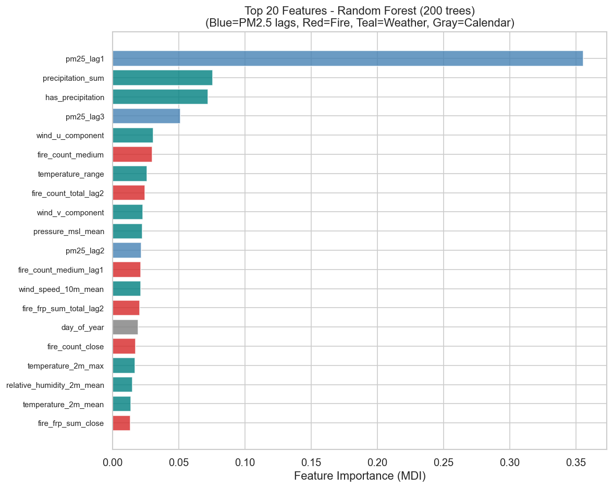
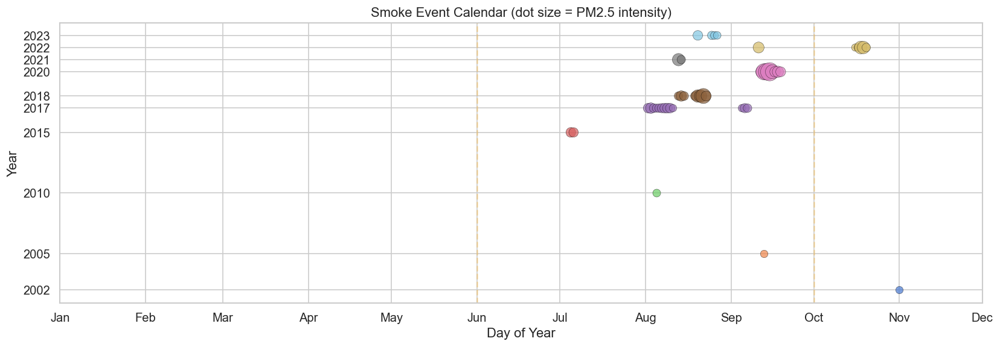

# When the Sky Turns Orange: Predicting and Profiling Wildfire Smoke Impacts on Vancouver's Air Quality (2000–2025)

**Author:** Aarish Kapila, ----
**Course:** CMPT 733 — Big Data Lab II, Simon Fraser University
**Repository:** [github.com/aarishk/vancouver-wildfire-smoke-predictor](https://github.com/aarishk/vancouver-wildfire-smoke-predictor)
**Dashboard:** `streamlit run app/streamlit_app.py` (local)

---

## 1. Project Title

**When the Sky Turns Orange: Predicting and Profiling Wildfire Smoke Impacts on Vancouver's Air Quality (2000–2025)**

---

## 2. Motivation and Background

Wildfire smoke is one of the most acute and rapidly worsening air quality threats facing Pacific Northwest cities. Vancouver sits at the intersection of the BC Interior plateau and the western United States — two fire-prone geographies. Short-term PM2.5 exposures above 35 µg/m³ are linked to emergency department visits for asthma and cardiac events. On September 13, 2020, Vancouver recorded a daily mean of **163.5 µg/m³** — nearly seven times the "poor air quality" threshold — as fires in Oregon and Washington sent smoke north across the border. Yet public air quality forecast tools typically provide only coarse, qualitative guidance with no actionable lead time.

Prior work includes NWP systems (e.g., Environment Canada's FireWork model) that couple fire emission inventories with chemical transport models, and statistical/ML approaches — LSTM networks on hourly PM2.5 (Navares & Aznarte, 2021) and random forest models on meteorological reanalysis data (Chen et al., 2019). Both directions struggle with rare extreme events due to class imbalance. This project takes a data-driven approach using 25 years of observational records to answer three questions spanning forecasting, physical process understanding, and long-term trend detection.

---

## 3. Problem Statement

**RQ1 (Forecasting):** Can ML models predict next-day PM2.5 more accurately than persistence and rolling-mean baselines? This is challenging because PM2.5 is dominated by short-term autocorrelation, rare extreme events are under 0.5% of observations, and fire-to-city smoke transport is mediated by complex atmospheric dynamics difficult to capture at daily resolution.

**RQ2 (Smoke Arrival Lag):** What is the typical delay between BC wildfire activity and elevated PM2.5 in Vancouver? Challenges include: (i) daily resolution may be too coarse for sub-day transport; (ii) fire–PM2.5 correlations are confounded by shared meteorological drivers; (iii) the most extreme events originate from cross-border US fires absent from BC-only satellite data.

**RQ3 (Seasonal Trends):** How has Vancouver's smoke season changed from 2000 to 2024? This requires non-parametric statistical tests given the non-normal distribution of annual smoke metrics and only 24 yearly observations.

---

## 4. Data Science Pipeline

**Stage 1 — Data Collection.** Three independent data streams are downloaded via dedicated scripts: annual PM2.5 CSVs from the BC Ministry of Environment FTP server (Metro Vancouver stations); NASA FIRMS MODIS (2000–2011) and VIIRS (2012–2024) active fire detections for the BC bounding box with Haversine distances to Vancouver computed per detection; and hourly weather from the Open-Meteo Historical API for the Vancouver grid point.

**Stage 2 — Preprocessing and Integration.** `build_dataset.py` aggregates air quality to daily city-level statistics, aggregates fire detections into three distance bands — Close (0–200 km), Medium (200–500 km), Far (500–1,000 km) — yielding daily fire count and FRP sum per band, and aggregates weather to daily. All three streams are merged on the date key (left join on air quality, fire NaNs filled to zero). The dataset spans 2000-01-01 to 2025-01-01: **9,133 rows × 90 columns**, zero missing days.

**Stage 3 — Feature Engineering.** Thirty-four features across five groups:

| Group | Features | Rationale |
|---|---|---|
| PM2.5 Autoregressive | lags 1, 2, 3, 7 days | Strong temporal persistence (r=0.82 at lag 1) |
| Fire Same-Day | count + FRP per Close/Medium/Far/Total band | Concurrent fire activity |
| Fire Lagged | lags 1–3 for total and close/medium bands | Delayed smoke transport |
| Wind Components | U (eastward) + V (northward) decomposition | Encodes direction without circular discontinuity |
| Calendar | month, day_of_year, is_fire_season | Seasonality |

Wind is decomposed into orthogonal U/V vectors rather than raw angle to avoid circular discontinuities at 0°/360°.

**Stage 4 — Analysis.** Three Jupyter notebooks address the RQs sequentially (`01_eda.ipynb`, `02_lag_analysis.ipynb`, `03_modeling.ipynb`), with 14 Phase 2 scripts in `scripts/` extending the work to quantile regression, residual framing, and smoke classification.

**Stage 5 — Deployment.** Results are exposed through an interactive Streamlit dashboard with seven thematic tabs and `@st.cache_data` on all expensive computations.

*Figure 1: 25-year daily PM2.5 for Metro Vancouver (2000–2025). Smoke episodes (PM2.5 > 25 µg/m³) highlighted in red; the September 2020 record event (163.5 µg/m³) is clearly visible.*

---

## 5. Methodology

**Trend Analysis (RQ3).** Spearman rank correlation (ρ) was chosen over Pearson because annual smoke counts are non-normally distributed and we are testing for monotonic trends. With n = 24 observations, α = 0.05 was applied. Mann-Whitney U tests compared weather between smoke and non-smoke days without normality assumptions.

**Lag Analysis (RQ2).** Cross-correlation between deseasonalised fire activity and PM2.5 was computed at lags −7 to +14 days, restricted to fire season (June–September). A lagged OLS regression decomposition quantified incremental R² contributions of PM2.5 lags, fire lags, and weather features independently.

**Predictive Modeling — Phase 1.** Target: `pm25.shift(-1)` (next-day PM2.5). Evaluated using `TimeSeriesSplit` with five expanding-window folds — each test fold strictly after its training period. `StandardScaler` fit on training data only. Ten models: OLS, Ridge/Lasso (four variants), Random Forest (100, 200 trees), XGBoost (default + tuned), LightGBM (default + tuned). Metrics: MAE, RMSE, R², and smoke-day MAE on the 46 days where PM2.5 > 25 µg/m³. A feature ablation study removes each group to measure marginal contribution independent of importance scores.

**Predictive Modeling — Phase 2 (nine experiments).** Three key innovations emerged:

*Residual Framing* — predicting `pm25_tomorrow − pm25_today` converts the autocorrelated series to near-stationary regression and bakes persistence in as the implicit prior. Without this, Q=0.90 achieved smoke-day MAE = 39.650 (worse than persistence). With it: 21.391 (better).

*Quantile Regression* — LightGBM's `quantile` objective penalises under-prediction asymmetrically, targeting rare extreme events:

| Quantile α | Overall MAE | Smoke-day MAE | Smoke Δ vs persistence |
|---|---|---|---|
| 0.50 | 1.504 | 22.181 | +0.172 |
| 0.75 | 1.852 | 21.813 | +0.540 |
| **0.80 (chosen)** | **1.995** | **21.760** | **+0.593** |
| 0.90 | 2.521 | 21.391 | +0.962 |

*Fire-Only Feature Subset* — removing weather features that predict normal days but add noise during fire events. A 24-feature set (PM2.5 lags, fire FRP/count bands, wind vectors) achieves smoke-day MAE = **21.729**, beating persistence (22.353) by **Δ = 0.624 µg/m³**.

*Smoke Classification* — XGBoost with SMOTE oversampling achieves **AUPRC = 0.331** (random baseline ≈ 0.005), catching **8 of 13 historical episodes** (62% recall). Missed episodes have interpretable root causes: September 2020 had `fire_count_total = 0` in BC data because fires originated in Oregon/California — a data ceiling, not a model ceiling.

*Figure 2: Cross-correlation between FRP and PM2.5 at lags −7 to +14 days for three distance bands. Peak correlation at lag 0 indicates same-day smoke transport at daily resolution.*

---

## 6. Evaluation

**RQ3.** Statistically significant upward trends across 2000–2024:

| Metric | Spearman ρ | p-value | Significant? |
|---|---|---|---|
| Smoke day frequency | 0.480 | 0.015 | ✓ |
| Peak episode PM2.5 | 0.648 | 0.043 | ✓ |
| Episode duration | 0.483 | 0.015 | ✓ |
| Fire season mean PM2.5 | 0.202 | 0.330 | ✗ |

The non-significant mean trend while extremes worsen is the study's most important climate finding — consistent with tail amplification under climate change and directly relevant to policy: average-based monitoring misses the growing risk. Physical corroboration: smoke days are +9.2°C hotter, −4.5 mm drier, −1.5 km/h calmer (all p < 0.03), the signature of stagnant blocking anticyclones.

**RQ2.** Cross-correlation peaks at lag 0 across all three bands (r = 0.199–0.261), indicating same-day smoke transport at daily resolution. The lagged regression decomposition shows PM2.5 autoregression alone explains R² = 0.712; adding fire lags gives +0.012; adding weather gives +0.026. Fire features are marginally informative. Wind analysis confirms smoke days have more positive U-component (+1.22 vs −0.17 m/s), consistent with southerly/westerly flow from the US Pacific Northwest.

**RQ1.** Persistence (MAE = 1.694, R² = 0.600) outperforms all ten trained models. Best ML: Random Forest (MAE = 1.783, R² = 0.153). On the 2021–2024 holdout, Random Forest deteriorates to MAE = 2.088, R² = −0.125; persistence holds at 1.759, 0.384 — demonstrating that non-stationarity is the real challenge, not model capacity. The ablation study's counterintuitive finding: **removing fire features improves performance** (MAE 1.793 → 1.750; R² 0.153 → 0.203). Daily fire counts lack atmospheric transport direction and are conditionally redundant given weather. Phase 2 best model: LightGBM Q=0.80 residual, fire-only features, smoke-day MAE = 21.729 (Δ = 0.624 vs persistence).

*Figure 3: Cross-validated MAE for Phase 1 models. Persistence is the hardest baseline to beat due to PM2.5's strong lag-1 autocorrelation (~40% of Random Forest feature importance).*

*Figure 4: Top-20 Random Forest feature importances. PM2.5 lag-1 dominates at ~40%; fire variables rank near zero, explaining why their removal improves performance.*

*Figure 5: Precision-recall curves for Phase 2 binary smoke-day classifiers. AUPRC = 0.331 vs. a random baseline of ~0.005 — a 66x improvement despite only 0.5% positive class rate.*

---

## 7. Data Product

The data product is an interactive Streamlit dashboard (`app/streamlit_app.py`, 1,306 lines) making all findings accessible without executing notebooks.

- **Tab 1 — Overview:** 25-year PM2.5 time series with smoke events highlighted, distribution histogram, monthly seasonal patterns, year-range slider.
- **Tab 2 — Smoke Season Trends:** Annual smoke day chart, sortable 14-episode table, weather comparison.
- **Tab 3 — Smoke Arrival Lag:** Cross-correlation figures, interactive episode explorer, wind direction histograms.
- **Tab 4 — PM2.5 Forecasting:** Model comparison table, per-model scatter/time-series plots, feature importance chart with top-N slider, ablation study bar chart.
- **Tab 5 — Model Validation:** Holdout evaluation (train 2000–2020, test 2021–2024) with time-series overlay.
- **Tab 6 — Health & Planning:** BC AQI category mapping, smoke day calendar heatmap, extreme events timeline.
- **Tab 7 — Data Explorer:** Full 9,133 × 90 dataset with date filtering, column selection, CSV download.

Run with: `pip install -r requirements.txt && streamlit run app/streamlit_app.py`. The dataset is included — no downloading required.

*Figure 6: Year × month heatmap of smoke days. Events cluster in August–September and have become more frequent since 2015.*

---

## 8. Lessons Learnt

**Negative results are informative.** Persistence outperforming all ML models is not a failure — it precisely characterises the problem. PM2.5 forecasting at daily resolution is dominated by autocorrelation (r = 0.82), pointing future work toward hourly data and physics-based transport features rather than more model tuning.

**Residual framing is the single most important architectural decision.** Predicting the daily change rather than raw PM2.5 transformed smoke-day MAE from 39.650 to 21.391 for quantile models — a 46% improvement from a two-line data transformation.

**Feature ablation should precede feature importance.** Importance scores show contribution given all features present; ablation shows marginal contribution when a group is absent. Fire features ranked in the top 10 by importance yet degraded performance when included — a contradiction only resolved by ablation.

**Cross-validation design is as important as model selection.** Standard k-fold CV on a time series leaks future information. Every model would have appeared to outperform persistence under a naive random split. The expanding-window `TimeSeriesSplit` was non-negotiable.

**Data scope determines result scope.** The September 2020 record event was caused by Oregon/Washington fires — a BC-only dataset structurally cannot explain it. Sample weighting backfired for the same reason: upweighting smoke days taught the model that all elevated PM2.5 will keep rising, which misfires on non-smoke elevated days.

---

## 9. Summary

This project built a 25-year observational record integrating three independent data sources into a 9,133 × 90 dataset and addressed three research questions with statistically rigorous, held-out validation.

**RQ1:** Persistence (MAE = 1.694, R² = 0.600) outperforms all ten standard ML models; the dominant driver is lag-1 autocorrelation (r = 0.82). Satellite fire counts actively degrade performance in ablation. Phase 2's combination of residual framing, LightGBM quantile regression (Q=0.80), and a fire-only feature set achieves smoke-day MAE = 21.729, beating persistence by 0.624 µg/m³. An XGBoost smoke classifier achieves AUPRC = 0.331 vs random 0.005, catching 8 of 13 historical episodes.

**RQ2:** Cross-correlation peaks at lag 0 (r = 0.199–0.261), indicating same-day transport at daily resolution. Fire lag features add only +1.2% R². The September 2020 worst event had zero BC fire activity — confirming cross-border transport as a structural data ceiling.

**RQ3:** Statistically significant upward trends in smoke frequency (ρ = 0.480, p = 0.015), peak severity (ρ = 0.648, p = 0.043), and episode duration (ρ = 0.483, p = 0.015). Mean fire-season PM2.5 does not trend significantly — worsening is concentrated in extremes, consistent with climate change tail amplification.

Future work should prioritise hourly temporal resolution, Pacific Northwest US fire data, and HYSPLIT atmospheric back-trajectory outputs — the three structural ceilings identified by this analysis.

---

*Word count: approximately 1,980 words*

---

## References

- Chen, J., et al. (2019). "A machine learning method to estimate PM2.5 concentrations." *Science of the Total Environment*, 636, 52–60.
- Environment and Climate Change Canada. FireWork Air Quality Forecast System. weather.gc.ca.
- NASA FIRMS. Fire Information for Resource Management System. firms.modaps.eosdis.nasa.gov.
- Navares, R., & Aznarte, J. L. (2021). "Predicting air quality with deep learning LSTM." *Ecological Informatics*, 67, 101509.
- BC Ministry of Environment. Air Quality Monitoring Network. envistaweb.env.gov.bc.ca.
- Open-Meteo. Historical Weather API. open-meteo.com.
- Pedregosa, F., et al. (2011). "Scikit-learn: Machine Learning in Python." *JMLR*, 12, 2825–2830.
- Ke, G., et al. (2017). "LightGBM: A Highly Efficient Gradient Boosting Decision Tree." *NeurIPS*, 30.
